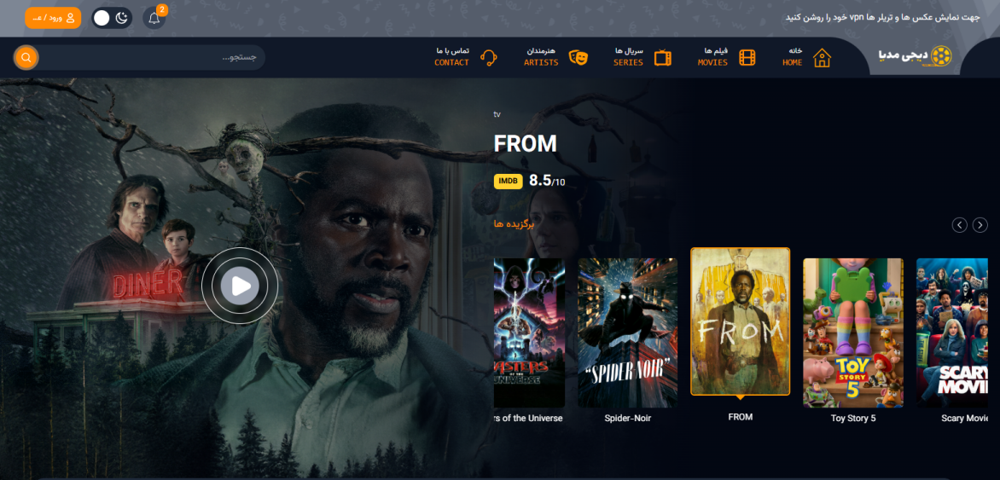

<div dir="rtl" align="right">

<div align="center">

# 🎬 دیجی مدیا | Digi Media

### پلتفرم معرفی، جستجو و کشف فیلم، سریال و بازیگران

[](https://nextjs.org/)
[](https://react.dev/)
[](https://tailwindcss.com/)
[](https://www.themoviedb.org/)
[](https://www.netlify.com/)

[🔗 مشاهده دمو آنلاین](https://digi-media-next.netlify.app/)

</div>

## 📸 پیش‌نمایش

<div align="center">



</div>
<br>

## 📖 درباره پروژه

**دیجی مدیا** یک وب‌سایت معرفی فیلم و سریال است که با استفاده از **Next.js** و **Tailwind CSS** ساخته شده و داده‌های خود (اطلاعات، تصاویر، تریلر و ...) را به‌صورت لحظه‌ای از **TMDB API** دریافت می‌کند.

نسخه اول این پروژه با **HTML, CSS و JavaScript خام** پیاده‌سازی شده بود؛ پس از یادگیری Next.js، کل پروژه از ابتدا و با معماری App Router، کامپوننت‌های قابل استفاده مجدد و رویکرد مدرن‌تر بازنویسی شد. هدف از این بازسازی، تجربه‌ی پیاده‌سازی یک پروژه واقعی و کامل با Next.js و تمرین الگوهای رایج فرانت‌اند (Server/Client Components، Middleware، Caching، Pagination و ...) بوده است.

> 💡 برای تجربه کامل و تعاملی، از [دمو آنلاین پروژه](https://digi-media-next.netlify.app/) دیدن کنید.

<br>

## ✨ ویژگی‌ها و امکانات

### 🔍 جستجو و فیلتر پیشرفته

- جستجوی **فیلم**، **سریال** و **بازیگر**
- فیلتر بر اساس **ژانر**، **سال تولید**، **امتیاز IMDB** و **کشور سازنده**
- مرتب‌سازی نتایج (محبوب‌ترین، پرامتیازترین، جدیدترین و ...)
- اسکرول بی‌نهایت (**Infinite Scroll**) همراه با **Pagination**

### 🎥 صفحات جزئیات

- صفحه اختصاصی برای هر **فیلم، سریال و بازیگر** با اطلاعات کامل
- نمایش **تریلر** مستقیم از یوتیوب
- بخش **پیشنهادهای مشابه (Recommendations)** و اسلایدر بازیگران/عوامل

### ❤️ واچ‌لیست و کاربر

- افزودن فیلم و سریال به **واچ‌لیست شخصی** (ذخیره‌سازی در LocalStorage)
- صفحه پروفایل کاربر با دسترسی محدودشده از طریق **Middleware** و **کوکی**

### 🎨 رابط کاربری و تجربه کاربری

- **دارک‌مود / لایت‌مود**
- طراحی کاملاً **واکنش‌گرا (Responsive)** برای موبایل، تبلت و دسکتاپ
- اسلایدرهای جذاب با **Swiper.js**
- فونت فارسی **Vazirmatn** و چیدمان کامل راست‌به‌چپ (RTL)

<br>

## 🛠 تکنولوژی‌های استفاده شده

| دسته        | تکنولوژی                                                 |
| ----------- | -------------------------------------------------------- |
| فریم‌ورک    | [Next.js 16](https://nextjs.org/) (App Router)           |
| کتابخانه UI | [React 19](https://react.dev/)                           |
| استایل‌دهی  | [Tailwind CSS 4](https://tailwindcss.com/)               |
| اسلایدر     | [Swiper.js](https://swiperjs.com/)                       |
| منبع داده   | [TMDB API](https://www.themoviedb.org/documentation/api) |
| احراز هویت  | کوکی + Middleware در Next.js                             |
| دیپلوی      | [Netlify](https://www.netlify.com/)                      |

<br>

## 📁 ساختار کلی پروژه

<div dir="ltr" align="left">

```
digi-media-NextJs/
├── app/
│   ├── (main)/
│   │   ├── (home)/        # صفحه اصلی
│   │   ├── movie/          # لیست و جزئیات فیلم‌ها
│   │   ├── series/         # لیست و جزئیات سریال‌ها
│   │   ├── actors/          # لیست و جزئیات بازیگران
│   │   ├── search/          # جستجو و فیلترها
│   │   └── profile/          # پروفایل و واچ‌لیست کاربر
│   ├── auth/                # صفحه ورود و ثبت‌نام
│   └── layout.js
├── components/             # کامپوننت‌های قابل استفاده مجدد (کارت‌ها، اسلایدرها، فیلترها و ...)
├── context/                 # Context API (مدیریت منو و ...)
├── middleware.js            # محافظت از مسیرهای پروفایل و ورود
└── public/                   # تصاویر، فونت‌ها و فایل‌های استاتیک
```

 </div>
<br>

## ⚙️ نصب و اجرای پروژه به‌صورت لوکال

```bash
# ۱. کلون کردن ریپازیتوری
git clone https://github.com/amirRezazade/digi-media-NextJs.git

# ۲. ورود به پوشه پروژه
cd digi-media-NextJs

# ۳. نصب پکیج‌ها
npm install

# ۴. اجرای پروژه در حالت توسعه
npm run dev
```

سپس آدرس [http://localhost:3000](http://localhost:3000) را در مرورگر باز کنید.

<br>

## 🔑 متغیرهای محیطی

برای اجرای پروژه به یک کلید API از **TMDB** نیاز دارید. کافیست در ریشه پروژه یک فایل `.env.local` بسازید و مقدار زیر را در آن قرار دهید:

```env
NEXT_PUBLIC_TMDB_API_KEY=your_tmdb_api_key_here
```

کلید API را می‌توانید به‌صورت رایگان از [سایت TMDB](https://www.themoviedb.org/settings/api) دریافت کنید.

<br>

## 🔐 نکته درباره احراز هویت

سیستم ثبت‌نام/ورود این پروژه به‌صورت **دمو و سمت کلاینت** پیاده‌سازی شده است؛ اطلاعات کاربر در یک **کوکی** ذخیره می‌شود و **Middleware** پروژه بر اساس وجود همین کوکی، دسترسی به صفحات پروفایل و واچ‌لیست را مدیریت می‌کند. هدف از این بخش، نمایش نحوه استفاده از Middleware و مسیرهای محافظت‌شده در Next.js است، نه ارائه یک سیستم احراز هویت واقعی متصل به بک‌اند.

<br>

## 🚀 ایده‌ها برای توسعه‌های آینده

- اتصال احراز هویت به یک بک‌اند واقعی و دیتابیس
- افزودن سیستم نظردهی و امتیازدهی کاربران
- پشتیبانی کامل از چند زبان (فارسی / انگلیسی)
- افزودن تست‌های واحد و یکپارچه‌سازی (Jest, Testing Library)
- بهبود بیشتر SEO و عملکرد (Performance)

<br>

## 👨‍💻 درباره توسعه‌دهنده

این پروژه به‌عنوان یک **نمونه‌کار (Portfolio Project)** برای تمرین و نمایش توانایی‌ها در **Next.js، React و Tailwind CSS** طراحی و توسعه داده شده است.

</div>
